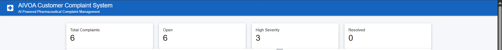
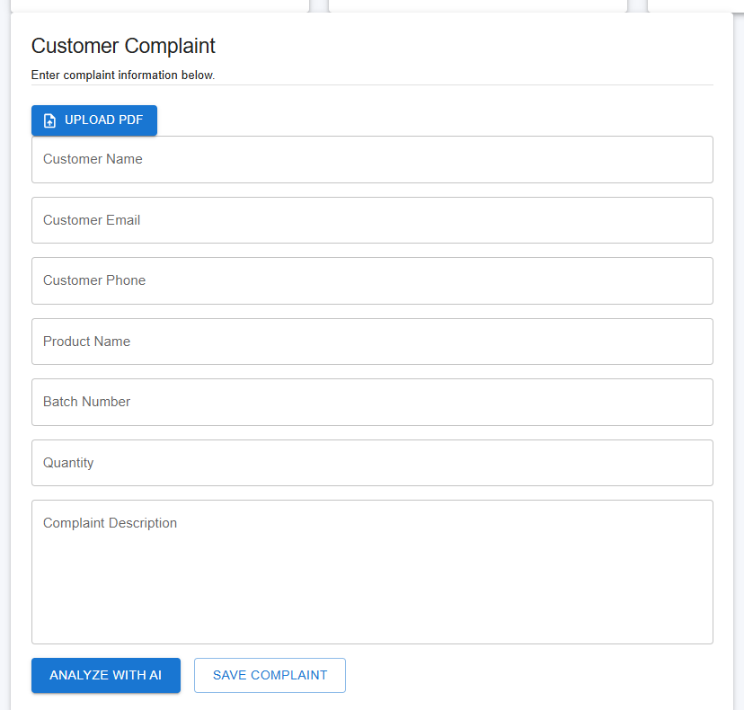
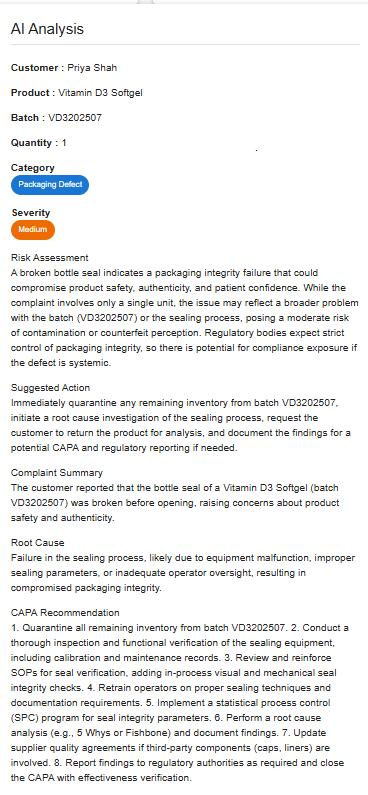
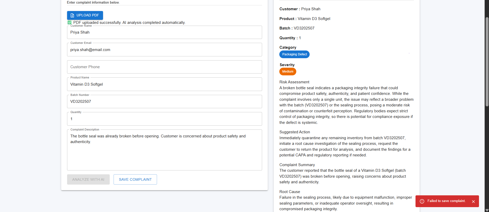
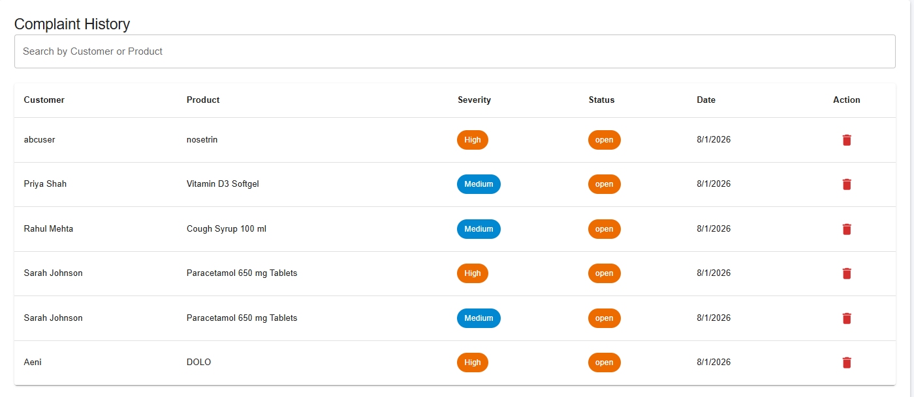

# 🧠 AIVOA Customer Complaint Management System

<div align="center">


### AI Powered Pharmaceutical Complaint Management System

An intelligent complaint management platform that leverages **Large Language Models (LLMs)** and **LangGraph workflows** to automate pharmaceutical complaint analysis, risk assessment, and corrective action recommendations.

</div>

---

# 📌 Overview

Pharmaceutical companies receive numerous customer complaints regarding medicines, packaging, dosage, and product quality. Manually reviewing these complaints is time-consuming and prone to inconsistency.

The **AIVOA Customer Complaint Management System** automates complaint processing using Artificial Intelligence. It extracts complaint information, classifies severity, performs risk assessment, detects duplicate complaints, and generates intelligent recommendations to assist Quality Assurance (QA) teams.

---

# 🎯 Objectives

- Automate complaint analysis using AI
- Reduce manual effort in complaint processing
- Detect duplicate complaints
- Prioritize complaints based on severity
- Generate actionable recommendations
- Provide a centralized dashboard for complaint management

---

# ✨ Features

## 📄 Complaint Management

- Manual Complaint Entry
- PDF Complaint Upload
- Automatic Data Extraction from PDF
- Complaint History
- Search Complaints
- Delete Complaint
- Duplicate Complaint Detection
- Save Anyway Confirmation

---

## 🤖 AI Features

The AI automatically provides:

- Complaint Category Detection
- Severity Classification
- Risk Assessment
- Suggested Next Action
- Complaint Summary
- Possible Root Cause
- CAPA (Corrective and Preventive Action) Recommendation

Powered by:

- LangGraph Workflow
- Groq LLM

---

## 📊 Dashboard

The dashboard displays:

- Total Complaints
- Open Complaints
- High Severity Complaints
- Resolved Complaints

---

# 🛠 Technology Stack

## Frontend

- React.js
- Material UI (MUI)
- Redux Toolkit
- Axios

---

## Backend

- FastAPI
- Python
- SQLAlchemy
- Pydantic

---

## Database

- MySQL

---

## Artificial Intelligence

- LangGraph
- Groq API (LLM)

---

# 🏗 System Architecture

```text
                    +----------------------+
                    |   React Frontend     |
                    +----------+-----------+
                               |
                               |
                               ▼
                    +----------------------+
                    |     FastAPI API      |
                    +----------+-----------+
                               |
        +----------------------+----------------------+
        |                                             |
        ▼                                             ▼
+--------------------+                     +--------------------+
|  LangGraph AI      |                     |     MySQL DB       |
|  Workflow          |                     | Complaint Records  |
+--------------------+                     +--------------------+
        |
        ▼
+--------------------+
|     Groq LLM       |
+--------------------+
```

---

# 🤖 AI Workflow

```text
Customer Complaint
        │
        ▼
Extract Complaint Information
        │
        ▼
Risk Assessment
        │
        ▼
AI Enhancement
        │
        ├──────────────► Complaint Summary
        ├──────────────► Root Cause
        ├──────────────► CAPA Recommendation
        ▼
Return Structured JSON
```

---

# 🗂 Project Structure

```text
AIVOA-Customer-Complaint-System
│
├── backend
│   ├── app
│   │   ├── ai
│   │   ├── api
│   │   ├── core
│   │   ├── models
│   │   ├── schemas
│   │   ├── services
│   │   └── main.py
│   │
│   └── requirements.txt
│
├── frontend
│   ├── src
│   │   ├── components
│   │   ├── pages
│   │   ├── redux
│   │   ├── services
│   │   └── assets
│   │
│   └── package.json
│
├── docs
│   └── images
│
└── README.md
```

---

# 📸 Screenshots

## Dashboard



---

## Complaint Form



---

## AI Analysis



---

## Duplicate Detection



---

## Complaint History



---

# 🚀 Installation

## Clone Repository

```bash
git clone https://github.com/<your-username>/AIVOA-Customer-Complaint-System.git
```

---

## Backend Setup

```bash
cd backend

python -m venv .venv

# Windows
.venv\Scripts\activate

# Linux / macOS
source .venv/bin/activate

pip install -r requirements.txt

uvicorn app.main:app --reload
```

Backend runs on:

```
http://127.0.0.1:8000
```

---

## Frontend Setup

```bash
cd frontend

npm install

npm run dev
```

Frontend runs on:

```
http://localhost:5173
```

---

# 📌 Key Functionalities

✅ AI Complaint Analysis

✅ PDF Upload & Parsing

✅ Duplicate Complaint Detection

✅ Complaint History Management

✅ Dashboard Analytics

✅ AI Summary Generation

✅ Root Cause Identification

✅ CAPA Recommendation

✅ Redux State Management

---

# 📈 Future Enhancements

- User Authentication & Role Management
- Complaint Status Workflow
- Email Notifications
- CSV / PDF Export
- Complaint Assignment
- Advanced Filters & Pagination
- Analytics Dashboard
- Audit Logs
- Docker Deployment
- Cloud Deployment

---

# 👩‍💻 Author

**Aeni Parmar**

Computer Engineering Graduate

Interested in AI, Data Analytics, Machine Learning, and Full Stack Development.

- GitHub: https://github.com/AeniParmar
- LinkedIn: https://linkedin.com/in/aeni-parmar

---

# 🙏 Acknowledgements

- React Team
- FastAPI
- Material UI
- LangGraph
- Groq
- SQLAlchemy
- Open Source Community

---

<div align="center">

⭐ If you found this project useful, consider giving it a star!

Made  by **Aeni Parmar**

</div>